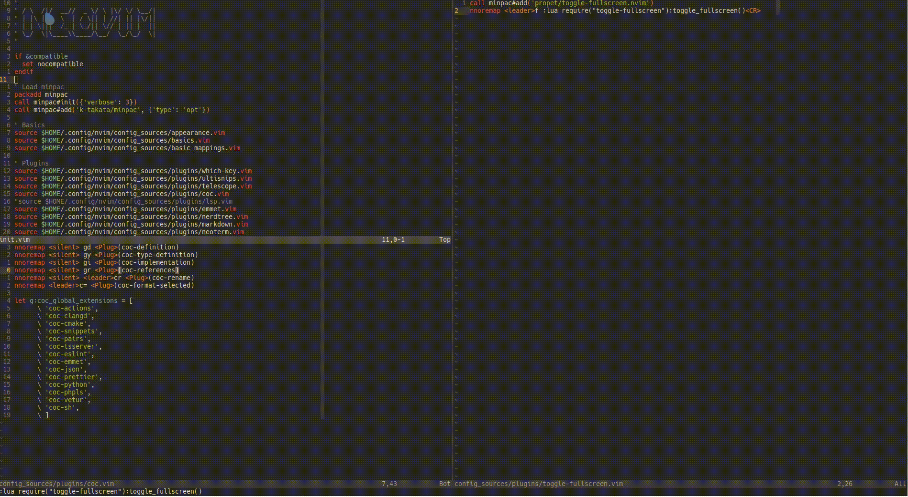

# toggle-fullscreen.nvim

Neovim lua plugin that toggles fullscreen for the selected window



# Requirements

Neovim 0.5 or greater

# Installation

```
Plug 'propet/toggle-fullscreen.nvim'
```

# Mappings

Call the `toggle_fullscreen` function however you like

```
nnoremap <leader>f :lua require("toggle-fullscreen"):toggle_fullscreen()<CR>
```
